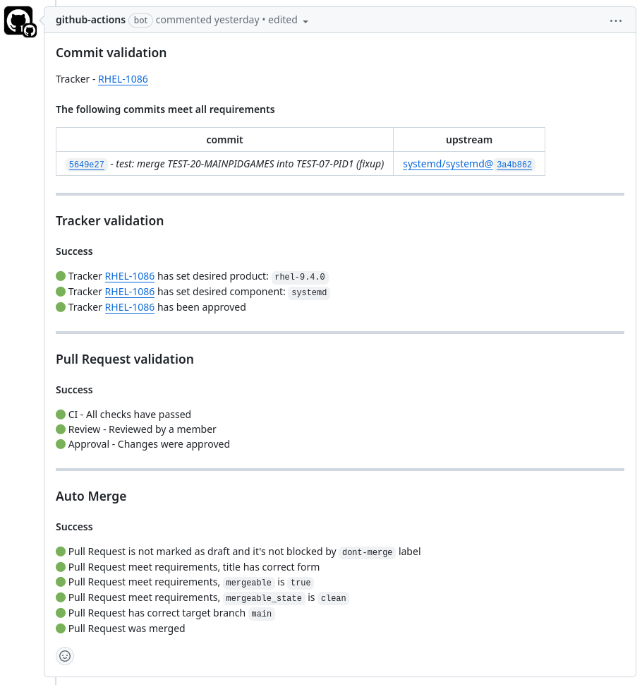

<!-- markdownlint-disable MD033 MD041 -->
<p align="center">
  <!--  -->
  <h1 align="center">Source Git Automation</h1>
</p>

[![GitHub Marketplace][market-status]][market]

<!-- Status links -->

[market]: https://github.com/marketplace/actions/source-git-automation
[market-status]: https://img.shields.io/badge/Marketplace-Source%20Git%20Automation-blue.svg?colorA=24292e&colorB=0366d6&style=flat&longCache=true&logo=data:image/png;base64,iVBORw0KGgoAAAANSUhEUgAAAA4AAAAOCAYAAAAfSC3RAAAABHNCSVQICAgIfAhkiAAAAAlwSFlzAAAM6wAADOsB5dZE0gAAABl0RVh0U29mdHdhcmUAd3d3Lmlua3NjYXBlLm9yZ5vuPBoAAAERSURBVCiRhZG/SsMxFEZPfsVJ61jbxaF0cRQRcRJ9hlYn30IHN/+9iquDCOIsblIrOjqKgy5aKoJQj4O3EEtbPwhJbr6Te28CmdSKeqzeqr0YbfVIrTBKakvtOl5dtTkK+v4HfA9PEyBFCY9AGVgCBLaBp1jPAyfAJ/AAdIEG0dNAiyP7+K1qIfMdonZic6+WJoBJvQlvuwDqcXadUuqPA1NKAlexbRTAIMvMOCjTbMwl1LtI/6KWJ5Q6rT6Ht1MA58AX8Apcqqt5r2qhrgAXQC3CZ6i1+KMd9TRu3MvA3aH/fFPnBodb6oe6HM8+lYHrGdRXW8M9bMZtPXUji69lmf5Cmamq7quNLFZXD9Rq7v0Bpc1o/tp0fisAAAAASUVORK5CYII=

<!-- -->

Source Git Automation is a composite GitHub Action that automates the source git repository. It provides out of the box working set of tools for commit and Pull Request validation, integration with external trackers like [Bugzilla](https://www.bugzilla.org/) and [Jira](https://www.atlassian.com/software/jira), automatic merging of Pull Requests and more. It's initially designed for [systemd source git repositories](https://github.com/redhat-plumbers#systemd), but can be easily adapted to other projects.

> [!NOTE]
>
> Source Git is a git repository with upstream sources, additional downstream commits, and sources. It's excellent for packages with high downstream activity (like systemd, kernel, etc.).

<p align="center">
  
  </br>
  <i>Source Git Automation status report example</i>
</p>


## Key Features

Source Git Automation is all you need to automate your source git repository. It provides the following features:

### Commit Linting

It validates commit messages against a set of rules. It can verify if the commit originates from a given upstream repository and if it references tracker issues in the correct format.

Powered by: [Advanced Commit Linter](https://github.com/redhat-plumbers-in-action/advanced-commit-linter) GitHub Action

### Tracker Integration and Validation

It validates provided tracker references and updates them with a link to the Pull Request. Supported tracker systems:

- [Bugzilla](https://www.bugzilla.org/)
- [Jira](https://www.atlassian.com/software/jira)

Powered by: [Tracker Validator](https://github.com/redhat-plumbers-in-action/tracker-validator) GitHub Action

### Pull Request Validation

It validates Pull Requests against a set of rules. It can verify that the Pull Request has been properly reviewed and that all CI checks have passed.

Powered by: [Pull Request Validator](https://github.com/redhat-plumbers-in-action/pull-request-validator) GitHub Action

### Automatic Pull Request Merging

Automatically merge Pull Requests that meet the set of rules. If all of the above validators have passed and nothing is blocking the merge, then the Pull Request is automatically merged. GitHub Action also indicates that the PR was merged in the linked tracker in a comment. Supported tracker systems:

- [Bugzilla](https://www.bugzilla.org/)
- [Jira](https://www.atlassian.com/software/jira)

Powered by: [Auto Merge](https://github.com/redhat-plumbers-in-action/auto-merge) GitHub Action

## Installation

Enabling of Source Git Automation for requires the following steps:

> [!TIP]
>
> Example of Pull Request that enables Source Git Automation for systemd RHEL7 repository can be found [redhat-plumbers/systemd-rhel7#151](https://github.com/redhat-plumbers/systemd-rhel7/pull/151).

### Running on Pull Requests

```yml
name: Gather Pull Request Metadata
on:
  pull_request:
    types: [ opened, reopened, synchronize ]
    branches:
      - master
      - rhel-7.*

permissions:
  contents: read

jobs:
  gather-metadata:
    runs-on: ubuntu-latest

    steps:
      - name: Repository checkout
        uses: actions/checkout@v4

      - id: Metadata
        name: Gather Pull Request Metadata
        uses: redhat-plumbers-in-action/gather-pull-request-metadata@v1

      - name: Upload artifact with gathered metadata
        uses: actions/upload-artifact@v3
        with:
          name: pr-metadata
          path: ${{ steps.Metadata.outputs.metadata-file }}
```

<p align="center">
  <i>gather-metadata.yml</i>
</p>

```yml
name: Source git Automation
on:
  workflow_run:
    workflows: [ Gather Pull Request Metadata ]
    types:
      - completed

permissions:
  contents: read

jobs:
  download-metadata:
    if: >
      github.event.workflow_run.event == 'pull_request' &&
      github.event.workflow_run.conclusion == 'success' &&
      github.repository == 'redhat-plumbers/systemd-rhel7'
    runs-on: ubuntu-latest

    outputs:
      pr-metadata: ${{ steps.Artifact.outputs.pr-metadata-json }}

    steps:
      - id: Artifact
        name: Download Artifact
        uses: redhat-plumbers-in-action/download-artifact@v1
        with:
          name: pr-metadata

  source-git-automation:
    needs: [ download-metadata ]
    runs-on: ubuntu-latest

    permissions:
      # required for merging PRs
      contents: write
      # required for PR comments and setting labels
      pull-requests: write


    steps:
      - name: Source-git Automation
        uses: redhat-plumbers-in-action/source-git-automation@v1
        with:
          pr-metadata: ${{ needs.download-metadata.outputs.pr-metadata }}
          bugzilla-api-token: ${{ secrets.BUGZILLA_API_TOKEN }}
          jira-api-token: ${{ secrets.JIRA_API_TOKEN }}
          token: ${{ secrets.GITHUB_TOKEN }}
```

<p align="center">
  <i>source-git-automation.yml</i>
</p>

### Running on Schedule and on Demand

```yml
name: Source git Automation Scheduled/On Demand
on:
  schedule:
    # Workflow runs every 45 minutes
    - cron: '*/45 * * * *'
  workflow_dispatch:
    inputs:
      pr-number:
        description: 'Pull Request number/s ; when not provided, the workflow will run for all open PRs'
        required: true
        default: '0'

permissions:
  contents: read

jobs:
  # Get all open PRs
  gather-pull-requests:
    if: github.repository == 'redhat-plumbers/systemd-rhel7'
    runs-on: ubuntu-latest

    outputs:
      pr-numbers: ${{ steps.get-pr-numbers.outputs.result }}
      pr-numbers-manual: ${{ steps.parse-manual-input.outputs.result }}

    steps:
      - id: get-pr-numbers
        if: inputs.pr-number == '0'
        name: Get all open PRs
        uses: actions/github-script@v6
        with:
          # !FIXME: this is not working if there is more than 100 PRs opened
          script: |
            const { data: pullRequests } = await github.rest.pulls.list({
              owner: context.repo.owner,
              repo: context.repo.repo,
              state: 'open',
              per_page: 100
            });
            return pullRequests.map(pr => pr.number);
      - id: parse-manual-input
        if: inputs.pr-number != '0'
        name: Parse manual input
        run: |
          echo "result="[ ${{ inputs.pr-number }} ]"" >> $GITHUB_OUTPUT
        shell: bash

  validate-pr:
    name: 'Validation of Pull Request #${{ matrix.pr-number }}'
    needs: [ gather-pull-requests ]
    runs-on: ubuntu-latest

    strategy:
      fail-fast: false
      matrix:
        pr-number: ${{ inputs.pr-number == 0 && fromJSON(needs.gather-pull-requests.outputs.pr-numbers) || fromJSON(needs.gather-pull-requests.outputs.pr-numbers-manual) }}

    permissions:
      # required for merging PRs
      contents: write
      # required for PR comments and setting labels
      pull-requests: write

    steps:
      - name: Source-git Automation
        uses: redhat-plumbers-in-action/source-git-automation@v1
        with:
          pr-number: ${{ matrix.pr-number }}
          bugzilla-api-token: ${{ secrets.BUGZILLA_API_TOKEN }}
          jira-api-token: ${{ secrets.JIRA_API_TOKEN }}
          token: ${{ secrets.GITHUB_TOKEN }}
```

<p align="center">
  <i>source-git-automation-on-demand.yml</i>
</p>

### Configuration

Following configuration is required for both when running on Pull Requests and on Schedule or on Demand.

#### Advanced Commit Linter configuration

Example of configuration file for Advanced Commit Linter. Linter with following configuration checks two things:

1. It checks if the commit message references (cherry-pick) upstream commit or it includes one of exception strings (`rhel-only` of `RHEL-only`).
2. It looks for issue tracker. It can be either Bugzilla or Jira tracker. Tracker references have to start with one of the specified keywords and have to be followed by a valid issue tracker ID specified in `issue-format`.

See [Advanced Commit Linter](https://github.com/redhat-plumbers-in-action/advanced-commit-linter) documentation for more details.

```yml
policy:
  cherry-pick:
    upstream:
      - github: systemd/systemd
    exception:
      note:
        - rhel-only
        - RHEL-only
  tracker:
    - keyword:
        - 'Resolves: #?'
        - 'Related: #?'
        - 'Reverts: #?'
      type: bugzilla
      issue-format:
        - '\d+$'
      url: 'https://bugzilla.redhat.com/show_bug.cgi?id='
    - keyword:
        - 'Resolves: '
        - 'Related: '
        - 'Reverts: '
      type: jira
      issue-format:
        - 'RHEL-\d+$'
      url: 'https://issues.redhat.com/browse/'
```

<p align="center">
  <i>.github/advanced-commit-linter.yml</i>
</p>

#### Pull Request Validator configuration

See [Pull Request Validator](https://github.com/redhat-plumbers-in-action/pull-request-validator) documentation for more details.

```yml
labels:
  missing-review: pr/needs-review
  changes-requested: pr/changes-requested
  missing-failing-ci: pr/needs-ci
```

<p align="center">
  <i>.github/pull-request-validator.yml</i>
</p>

#### Tracker Validator configuration

See [Tracker Validator](https://github.com/redhat-plumbers-in-action/tracker-validator) documentation for more details.

```yml
labels:
  missing-tracker: tracker/missing
  invalid-product: tracker/invalid-product
  invalid-component: tracker/invalid-component
  unapproved: tracker/unapproved
products:
  - Red Hat Enterprise Linux 7
  - rhel-7.4
  - rhel-7.4.z
  - rhel-7.6
  - rhel-7.6.z
  - rhel-7.7
  - rhel-7.7.z
  - rhel-7.9
  - rhel-7.9.z
```

<p align="center">
  <i>.github/tracker-validator.yml</i>
</p>

#### Auto Merge configuration

See [Auto Merge](https://github.com/redhat-plumbers-in-action/auto-merge) documentation for more details.

```yml
labels:
  dont-merge: dont-merge
  manual-merge: pr/needs-manual-merge
target-branch: ['rhel-7.9']
```

<p align="center">
  <i>.github/auto-merge.yml</i>
</p>

## Output

Source Git Automation provides a status report on the Pull Requests in form of a sticky comment (it updates existing comment instead of creating every time new one). It also utilizes GitHub labels to indicate the status of the Pull Request. Labels are configurable and can be set to match the project's needs.

<p align="center">
  
  </br>
  <i>Tracker and Pull Request validation example</i>
</p>

<p align="center">
  
  </br>
  <i>Missing review example</i>
</p>
